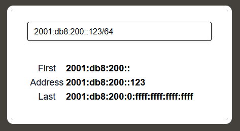

# Wat Dis?
As a network engineer I often find myself frustrated that the first page search results for "IP Calculator" are all bad. By bad I mean that they either:
- use deprecated classful IPv4 that died in the 1990's
- require you to enter IP-address and subnet separately
- fill the page with ads or other monetization junk

So, as a learning experience, I figured I would build my own IP-calculator website. This is the result:

  
*You specify the IP-address and what subnet it lives in, the webpage give you the network and broadcast address.*

I host the website here: https://ipcalc.golle.org/

# Architecture
This webpage is built using the GOTTH stack, which include:
- **Golang** - net/http standard library
- **Go Templ** - HTML templates
- **Tailwind** - CSS framework
- **HTMX** - Javascript framework

# Dev
Templ and Tailwind both have binaries (programs) that we can keep running in the background, dynamically re-generating the output files while during development. To hot-reload the Golang web server I use **wgo** as I couldn't get **air** to work correctly. With these three programs running in the background, the relevant files are automatically updated. Likewise, the web server is automatically restarted when it detects changes, so I can quickly see the changes when I refresh my browser.

## Wgo
> https://github.com/bokwoon95/wgo
Golang web server hot reload

```
go install github.com/bokwoon95/wgo@latest
wgo run ipcalc.go
```

## Templ
Compile templates into .go files
```
wget https://github.com/a-h/templ/releases/download/v0.3.833/templ_Linux_x86_64.tar.gz
tar -xzf templ_Linux_x86_64.tar.gz 

go get github.com/a-h/templ

./templ generate --watch
```
*VS-Code: Install extension **a-h.templ***

## Tailwind
```
apt install watchman
wget https://github.com/tailwindlabs/tailwindcss/releases/download/v4.0.14/tailwindcss-linux-x64
mv tailwindcss-linux-x64 tailwindcss
chmod +x tailwindcss
./tailwindcss -i tailwind.css -o ./static/css/style.css --watch
```
*VS-Code: Install extension **bradlc.vscode-tailwindcss***

# Test
Run this command to run tests:
```
$ go test ./...
```

# Build & Run locally
> https://hub.docker.com/repository/docker/golle/ipcalc/general

```
docker build . -t ghcr.io/emieli/golang-ipcalc:latest
docker run -p 8000:8000 golle/ipcalc
```
*You may need to run **docker login** first*

# Push to docker registry
We need to push the docker image to some docker registry, in this case Github:
```
docker push ghcr.io/emieli/golang-ipcalc:latest
```
